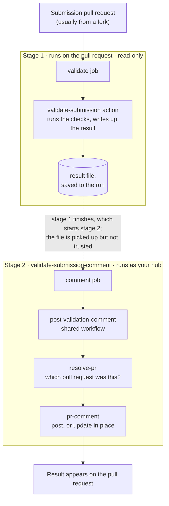

# validate-submission

Checks a submission as soon as it arrives and tells the submitter what is wrong,
without them having to go hunting through logs.

When someone opens a pull request adding or changing files under `model-output/`
or `model-metadata/`, those files are run through
[`hubValidations`](https://hubverse-org.github.io/hubValidations/articles/validate-pr.html).
The result is posted as a comment on the pull request, and the pull request's
check fails if anything did not pass.

Everything in this directory serves that one job:

| File | What it does |
|---|---|
| `validate-submission.yaml` | The workflow you add to your hub — the file GitHub runs. Most hubs use it exactly as it comes. Its companion, [`validate-submission-comment`](../validate-submission-comment), posts the result. |
| `action.yaml` | The action it calls — a reusable piece of work: sets up R, runs the checks, writes up the result. |
| `validate.R`, `summary.R` | The R behind it — running the checks, and turning their output into a comment. |
| `tests/` | Checks on the comment formatting, run in this repository's own CI. |

## Setting it up

From the root of your hub:

```r
hubCI::use_hub_github_action("validate-submission")
hubCI::use_hub_github_action("validate-submission-comment")
```

Two workflows, because one runs the checks and the other posts the result — see
[how it works](#how-it-works) for why that has to be split. Commenting is on by
default and the common case needs no settings at all. Without the second, the
checks still run and still fail the pull request; the result just never reaches
the submitter.

## What a submitter sees

A comment giving a pass or fail line and the check results, shown in full when
something failed and tucked behind a toggle when everything passed.

Each new commit gets its own comment, which notifies the submitter that the
result has changed. Re-running the same commit edits its existing comment instead
of adding another, so the pull request keeps a history of results without filling
up with duplicates.

If the checks never get to run at all — a bad hub config, an outage while
installing R packages — the submitter still gets a comment saying so, rather than
a bare red cross with no explanation.

### How it works



Most submissions come from forks of your hub, and GitHub deliberately gives a
fork's pull request **read-only** access — otherwise anyone who opened a pull
request could make your hub act on their behalf. So the job that runs the checks
is not allowed to comment on its own result.[^token]

The work is split in two because of that. This workflow runs on the pull request,
does the checks, and saves the result to the workflow run.
[`validate-submission-comment`](../validate-submission-comment) runs once that
finishes, as your hub rather than as the submitter, and posts it. It only ever
handles the saved file — it never checks out or runs anything from the pull
request — so a submission cannot get at the permissions it holds.[^triggers]

They have to be two separate files: GitHub rejects a workflow that names itself
as its own trigger, with `Workflow '...' cannot listen to itself`.

The saved file is not trusted either. A submission from a fork runs its own copy
of the `validate` job, so it controls what ends up in that file. This is why
Stage 2 works out which pull request to comment on from GitHub's own record of
what triggered it, rather than from anything Stage 1 produced. Otherwise a
submission could have your hub post onto someone else's pull request (this is
what [`resolve-pr`](../resolve-pr) does). What a submitter does still control is
the wording of the comment on their own pull request, which they could have typed
by hand anyway.

The `comment` job does not spell its steps out in your hub's copy. It calls a
[workflow kept here in hubverse-actions](../.github/workflows/post-validation-comment.yaml),
and that is deliberate. The copy of the workflow file in your hub is yours: once
you have added it, nothing we change afterwards reaches it. So it holds only the
parts you might genuinely want to adjust, and the machinery behind them stays on
our side, where you pick up fixes automatically instead of having to add a fresh
copy of the file every time something changes.

Stage 2 finds Stage 1 **by the workflow's name**. If you rename this workflow,
change the `workflows:` list in `validate-submission-comment.yaml` to match, or
results will quietly stop being posted. Nothing reports an error when the two
stop matching.

If the pull request is closed or merged in the gap between the checks finishing
and the comment being posted, there is nothing to comment on, and the job simply
stops rather than reporting a failure.

A very large submission can produce more output than GitHub will accept in a
single comment. When that happens the comment is trimmed to fit, keeping the end,
where the failures are listed. The workflow log always has the whole thing.

## Customising validation

Most hubs need none of this, but every option
[`validate_pr()`](https://hubverse-org.github.io/hubValidations/articles/validate-pr.html)
takes is available as a setting. Add them under `with:` on the
`validate-submission` step in your workflow file:

```yaml
- uses: hubverse-org/hubverse-actions/validate-submission@main
  with:
    summary: true
    skip_submit_window_check: true
```

| Input | Default | Description |
|---|---|---|
| `hub_path` | `.` | Path to the hub, relative to the checkout root. |
| `gh_repo` | workflow repo | Hub repository as `owner/name`. |
| `pr_number` | triggering PR | Pull request number to validate. |
| `round_id_col` | *(empty)* | Column holding round IDs, if not configured in `tasks.json`. |
| `output_type_id_datatype` | `from_config` | Type to convert `output_type_id` to. |
| `validations_cfg_path` | *(empty)* | Path to a custom validations config file. |
| `skip_submit_window_check` | `false` | Skip the submission window check. |
| `file_modification_check` | `error` | How to treat changes to files already submitted. |
| `allow_submit_window_mods` | `true` | Allow changes to model-output files while their window is open. |
| `submit_window_ref_date_from` | `file` | Where the submission window reference date comes from. |
| `derived_task_ids` | *(empty)* | Comma-separated task IDs derived from other task IDs. |
| `verbose` | `true` | Print the result of every check before the summary. |
| `show_warnings` | `false` | Print check-level warnings inline. |
| `summary` | `false`, but `true` in the template | Write up the result and save it for the companion workflow to post. Turn it off to keep results in the workflow log only; the companion workflow then finds nothing to post and stops quietly, so you can leave or delete it. |
| `artifact_name` | `submission-validation-results` | Name the result is saved under. Coordination between the two workflows rather than a setting to change. |
| `extra_packages` | *(empty)* | Extra R packages to install, for custom checks that need them. |
| `extra_repositories` | hubverse r-universe | Extra R package repositories. |
| `github_token` | `${{ github.token }}` | Token used to read the pull request's files. |

## Using the action on its own

If your hub needs a workflow of its own rather than the supplied one, the action
can be called directly. It assumes the repository is already checked out.

```yaml
steps:
  - uses: actions/checkout@v7
  - uses: hubverse-org/hubverse-actions/validate-submission@main
    with:
      skip_submit_window_check: true
```

It reports one output:

| Output | Description |
|---|---|
| `summary-path` | Where the written-up result was saved. Empty unless `summary` is on. |

For more on configuring the checks themselves, see the `hubValidations` vignette
on [Validating Pull Requests on GitHub](https://hubverse-org.github.io/hubValidations/articles/validate-pr.html).

## For maintainers: why the comment half is a workflow

`resolve-pr` and `pr-comment` get their own directories;
[`post-validation-comment`](../.github/workflows/post-validation-comment.yaml)
sits in `.github/workflows/` instead. Actions are found by path and can live
anywhere; workflows are only ever found by scanning `.github/workflows/`, and
that holds for reusable ones too.

It is a workflow rather than an action because only a workflow can carry
`concurrency:`, `permissions:` and a job-level `if:`. As an action those would
have to live in the template, which is copied into each hub and frozen there —
and the concurrency key in particular has already needed changing once.

[^token]: In GitHub's own terms: a `pull_request` workflow triggered from a fork
    gets a read-only `GITHUB_TOKEN`. `pull-requests: write` is downgraded and
    secrets are withheld, whatever the workflow asks for.

[^triggers]: The `comment` job is triggered by
    [`workflow_run`](https://docs.github.com/actions/using-workflows/events-that-trigger-workflows#workflow_run)
    on this workflow's own completion, which runs in the base repository's
    context with a write token. `pull_request_target` is deliberately avoided: it
    would run submitter-modifiable custom check code with that token.
